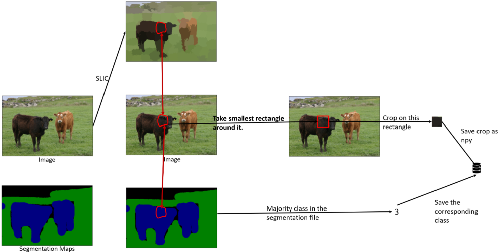

# SLIC Superpixel classification network

This project aims at building a neural network in order to classify superpixels generated from the SLIC algorithm. These class labels can then be used to generate a semantic segmentation map of the image. 
The dataset used for this project is the [MSRCv1 dataset](http://download.microsoft.com/download/A/1/1/A116CD80-5B79-407E-B5CE-3D5C6ED8B0D5/msrc_objcategimagedatabase_v1.zip).

The steps involved are as follows:
## Superpixel Generation
For each image :
 - 100 superpixels were generated using the SLIC algorithm
 - For each superpixel region, the best fitting rectangle is found and the region is dilated by 3 pixels.
 - This region is extracted from the original image and saved as a npy file along with the class ID for that region.
  

  
 

 
 ## Superpixel Classification Network
 A neural network was trained in PyTorch to classify each of the superpixels.
 Network training definition : 
 
 - A standard VGG16 network with pretrained Imagenet weights was loaded.
 - The last layer was removed a few linear layers were added to enable transfer learning.
 - Cross entropy loss was as a loss function. Stochastic gradient descent with momentum was used as the optimizer.
